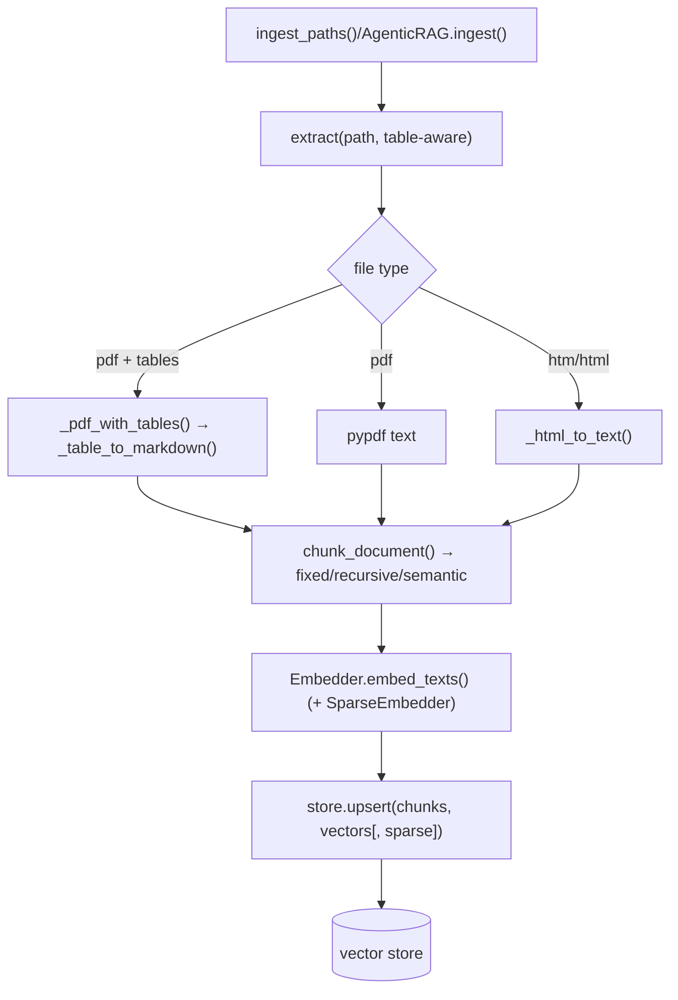
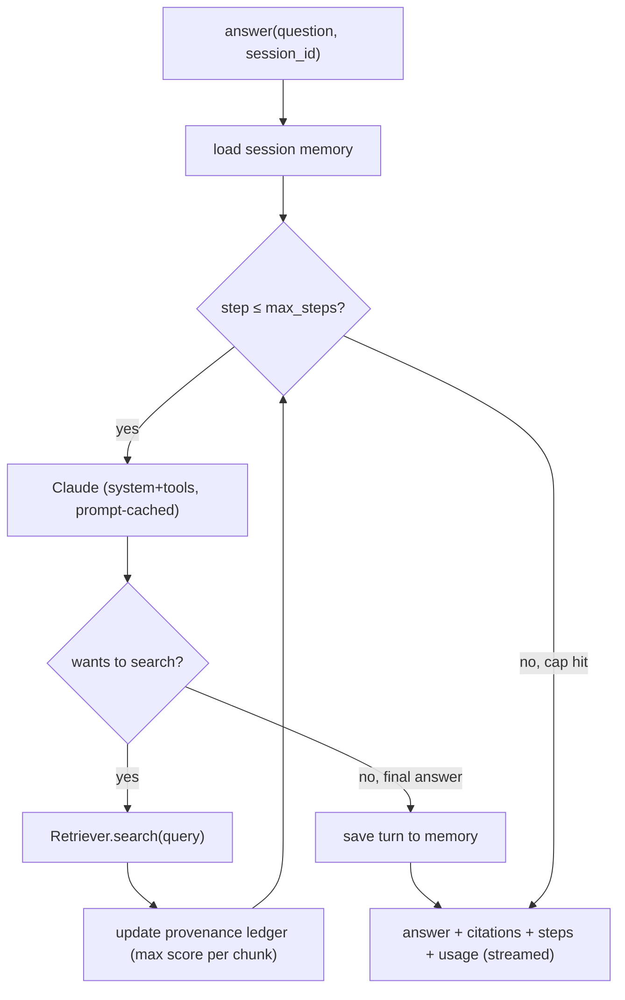
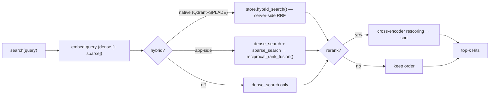

<!-- The YAML block above is the Hugging Face Spaces "Space card" — it MUST be the first thing in
     this file, or a Docker Space fails with "config error that prevents it from running". It's
     harmless on GitHub. `sdk: docker` + `app_port: 8000` route HF to our container (listens on 8000). -->

# Agentic RAG over Documents — cited answers, hybrid retrieval, a real agent loop

> Ask questions about your documents and get **answers grounded in the source**, with a citation
> trail (document, page, score) on every claim. Hybrid retrieval (dense + sparse) with cross-encoder
> reranking, an **agentic** loop that decides what to search and when, conversational memory, and a
> streaming **web UI** where anyone can plug in their own keys — served as a containerized FastAPI app.

This README is the **documentation + how-it-works**. To actually run/use it, see **[GUIDE.md](GUIDE.md)**.
There's also a portfolio write-up ([UPWORK_PORTFOLIO.md](UPWORK_PORTFOLIO.md)) and a reusable
agent-building prompt ([AGENT_BUILD_PROMPT.md](AGENT_BUILD_PROMPT.md)).

---

## 1. Why this exists

In finance, legal, and compliance, an answer is only useful if you can **trace it to its source**.
This system retrieves the relevant passages from your documents, lets the model run **multi-step**
retrieval for complex (multi-hop) questions, and returns every answer with the exact chunks —
document, page, and relevance score — that support it.

**Plain RAG vs Agentic RAG.** Plain RAG is a fixed pipeline: always retrieve once, then answer.
**Agentic RAG** (this project) hands the retriever to the model **as a tool**, so the model decides
*whether*, *what*, and *how many times* to search before answering — much better for multi-part
questions like *"How did revenue change from FY24 to FY25, and why?"*

## 2. Features

- **Agentic loop** — the model issues its own search queries and retrieves multiple times, with a hard step cap.
- **Source-traceable answers** — citation (source, page, chunk id, score) on every answer, de-duplicated.
- **Hybrid retrieval** — dense embeddings + sparse search, fused with Reciprocal Rank Fusion.
- **Cross-encoder reranking** (`BAAI/bge-reranker-v2-m3`) for a precision pass.
- **Three vector stores** — in-memory (zero setup), **Qdrant** (cloud/self-host), and **Postgres/pgvector** (e.g. Supabase) — chosen at runtime.
- **True hybrid on Qdrant** — learned **SPLADE/BM42** sparse vectors fused server-side via `query_points` prefetch + RRF.
- **Conversational memory** — per-session history so follow-ups resolve in context.
- **Table-aware ingestion** — PDF tables rendered as Markdown so numbers keep their structure.
- **Prompt caching** + **token streaming** (Server-Sent Events) for lower cost and a responsive UI.
- **Bring-your-own-keys web UI** — Settings · Upload · Ask · How-it's-built, all in one page.
- **Evaluation** — Ragas metrics + Langfuse tracing. **Containerized** FastAPI app with k8s manifests.

## 3. Architecture

```
                       ┌─────────────────────────────────────────────┐
  files (PDF/HTML)  ─▶ ingest: extract (table-aware) → chunk → embed (dense [+ sparse])
                       │                                  │           │
                       ▼                                  ▼           │
               ┌───────────────┐   in-memory /    ┌───────────────┐   │
               │   Qdrant      │  Qdrant Cloud /   │  pgvector     │   │
               │ named vectors │ ◀─ (config) ─────▶│ halfvec+HNSW  │   │
               │ + RRF fusion  │                   │ + Postgres FTS│   │
               └───────┬───────┘                   └───────┬───────┘   │
                       │   dense + sparse → RRF fusion      │           │
                       └──────────────┬─────────────────────┘           │
                                      ▼                                  │
                          cross-encoder rerank (top-k)                   │
                                      ▼                                  │
              ┌──────────────────────────────────────────┐              │
 question ──▶ │  AGENT LOOP (Claude decides re-query)     │ ◀ memory     │
              │  reason → search tool → observe → ...      │              │
              └──────────────────┬───────────────────────┘              │
                                 ▼                                       │
                  grounded answer + CITATION LEDGER (streamed)           │
                                 ▼                                       │
                    FastAPI: / (UI) · /upload · /ask · /ask/stream       │
                                 ▼                                       │
                       Docker → Hugging Face Spaces / k8s                │
              Langfuse traces the path · Ragas scores it offline ────────┘
```

### Module map
| Module | Role |
|---|---|
| `config.py` | Typed config (dataclasses), from `config.yaml` or runtime UI settings. |
| `ingest.py` | extract (table-aware) → chunk → embed → store. |
| `chunking.py` | Token-sized chunks: fixed / recursive / semantic. |
| `embeddings.py` | Dense vectors (OpenAI) **and** learned sparse vectors (SPLADE/BM42). |
| `stores.py` | One `VectorStore` interface; Qdrant (incl. in-memory) + pgvector backends. |
| `memory.py` | Per-session conversational memory (`SessionStore`). |
| `retrieval.py` | Hybrid search + RRF fusion + cross-encoder rerank. |
| `agent.py` | The agentic loop + provenance ledger + prompt caching + streaming + `ingest()`. |
| `api.py` | FastAPI: serves the UI, per-session pipelines, upload, ask, streaming. |

## 4. How it works (process walkthrough)

These diagrams render on GitHub / VS Code (Mermaid). They mirror the actual functions.

### 4a. Ingestion (offline): build the searchable index


### 4b. Asking a question (online): the agent loop


### 4c. Retrieval (per search)


**Key concepts in one line each:**
- **Chunking** is the #1 silent failure in RAG — a fact split across two chunks can't be retrieved; overlap guards boundaries.
- **Dense vs sparse** — dense finds *meaning* (synonyms), sparse finds *exact terms/numbers*; hybrid covers both.
- **RRF** fuses dense + sparse by *rank* (not raw score) so incomparable score scales don't matter.
- **Reranking** is a slow-but-precise second pass run only on a small candidate pool.
- **The provenance ledger** records every chunk the model sees (keeping the max score), then becomes the citations.
- **Prompt caching** caches the static system prompt + tools so multi-step loops cost less.

## 5. Configuration

Behavior is driven by `config.yaml` (CLI / server default) or, in the web UI, by per-session
settings. Key knobs:

```yaml
generator:  { use_prompt_caching: true }
vector_store: { backend: qdrant }          # qdrant | pgvector
chunking:   { strategy: recursive, chunk_tokens: 500, overlap_tokens: 50 }
retrieval:  { use_hybrid: true, use_reranker: true, sparse_backend: splade, top_k: 5 }
agent:      { max_steps: 6 }
memory:     { enabled: true, max_turns: 6 }
ingestion:  { extract_tables: true }
```

Config variants in the repo: `config.yaml` (local default), `config.k8s.yaml` (Qdrant-backed for
containers), `config.lite.yaml` (reranker off, for tiny 512 MB hosts).

## 6. Project layout

```
agentic-rag-financial/
├── src/agentic_rag/   config·ingest·chunking·embeddings·stores·memory·retrieval·agent·api
├── web/index.html     single-page UI (Settings · Upload · Ask · How-it's-built)
├── scripts/           download_filings · ingest · ask · run_eval
├── tests/             unit tests (pure logic, services stubbed)
├── agentic_rag_walkthrough.ipynb   annotated, runnable walkthrough of every module
├── config.yaml · config.k8s.yaml · config.lite.yaml
├── Dockerfile · docker-compose.yml · k8s/deployment.yaml
├── README.md (this) · GUIDE.md · UPWORK_PORTFOLIO.md · AGENT_BUILD_PROMPT.md · LICENSE
```

## 7. Evaluation

`scripts/run_eval.py` runs a labeled JSONL question set through the pipeline and reports **Ragas**
metrics (faithfulness, answer relevancy, context precision/recall), with every query traced in
**Langfuse**. Targets to beat: faithfulness ≥ 0.90, answer relevancy ≥ 0.85, context precision ≥ 0.80
(replace with your measured numbers).

## 8. Learn the codebase

Open **`agentic_rag_walkthrough.ipynb`** — it collects every module with detailed docstrings,
line-by-line comments, conceptual notes, and runnable offline demos (chunking, RRF, config, a stubbed
agent loop). It's the fastest way to understand or debug the system.

## 9. Tech stack

`Python` · `FastAPI` · `Anthropic Claude` · `OpenAI embeddings` · `Qdrant` · `pgvector / Supabase` ·
`SPLADE / BM42 (fastembed)` · `cross-encoder rerank` · `Server-Sent Events` · `Docker` · `Kubernetes` ·
`Ragas` · `Langfuse` · `pytest`

## License

MIT — see [LICENSE](LICENSE).
